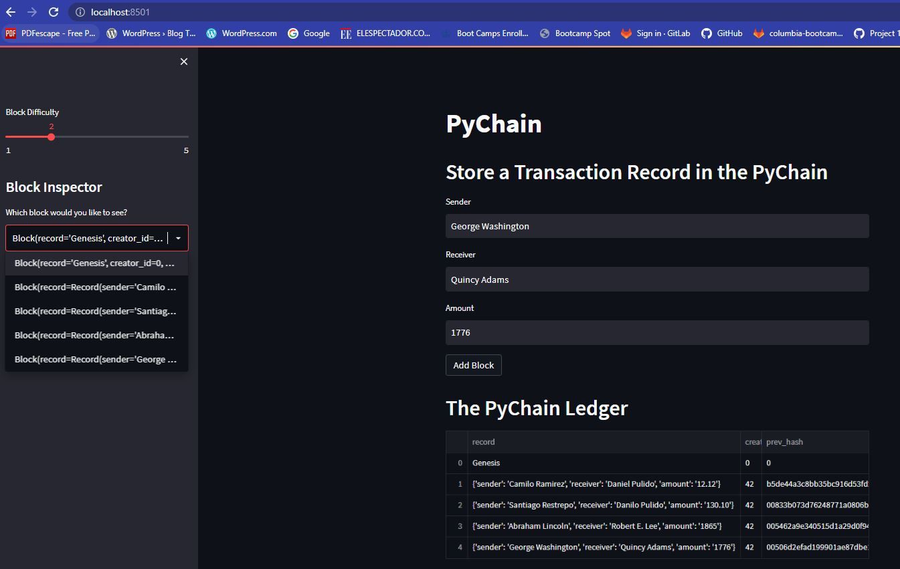
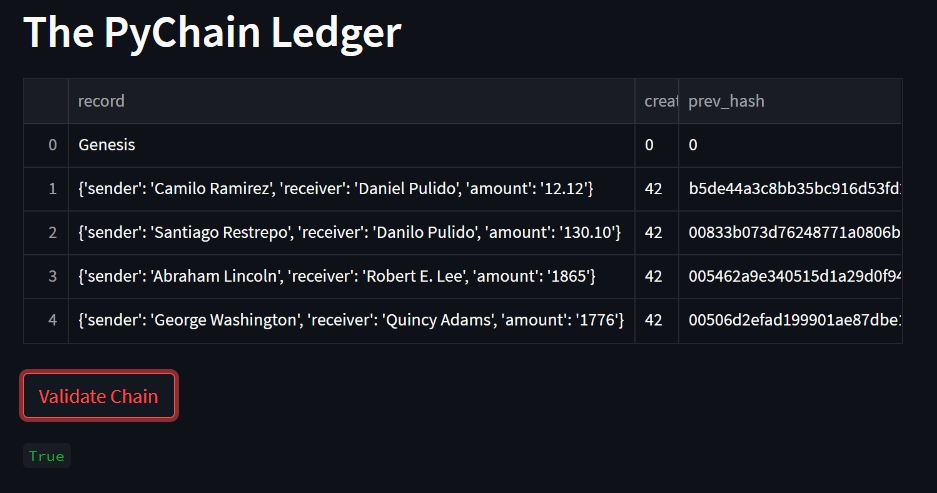

# Blockchain Demo

For this app you will need streamlit. If you don't have it installed in your environment you can type in terminal:

> pip install streamlit

This app emulates a blockchain used to record transactions between buyers and sellers. 

In the left margin you can modify the difficulty to create a new block. This is done by adding zeros at the start of the hash, the more zeros the longer it would take to add the new block. 

By clicking on "Validate Chain" the blockchain will be validated using the hash in each block. If the validation is successful you will get a "True" sign in green letters under the button. 

 

 

